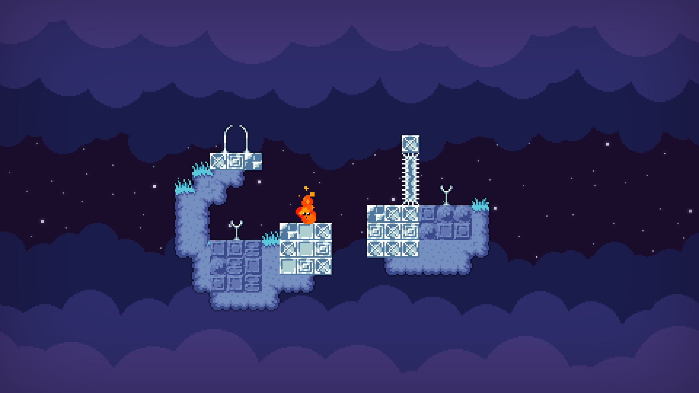

### BRIMSTONE

A short game made for Ludum Dare 49. Play as a piece of fire that destroys anything it touches!

Developed in 48 hours, using [this framework](https://github.com/HolyBlackCat/imp-re) of mine. Windows builds were cross-compiled from Linux using [quasi-msys2](https://github.com/HolyBlackCat/quasi-msys2).

Get the binaries from [itch.io](https://holyblackcat.itch.io/brimstone).

